Glossy Buckthorn CA
================
Tim Szewczyk
9/15/2017

This is a wrapper for running the glossy buckthorn cellular automata model. It sets up the environment, allows the assignment of all necessary parameters, runs the simulation, and visualizes the results.

The land cover within each cell is compositional rather than the more common hard classification. As a result, all land cover-specific parameters are computed proportionally to the land cover in a cell (i.e., lc.prop %\*% K, where lc.prop is a matrix with columns for land cover and a row for each cell, and K is a vector of carrying capacities with one per land cover type).

``` r
##---
## set parameters
##---

  set.seed(25)
  n.sim <- 1
  blockSize <- 2  # number of acres per block (width & height)
  cb.i <- make_cb_i(blockSize)
```

    ## Parsed with column specification:
    ## cols(
    ##   left = col_double(),
    ##   top = col_double(),
    ##   CellID = col_integer(),
    ##   roadLen = col_double(),
    ##   roadCt = col_double()
    ## )

``` r
  g.p <- list(
    # general
    tmax=25,  # num time steps per simulation
    stoch=FALSE,  # include stochasticity in demography/SDD?
    simple=FALSE,  # simple lambda growth vs. fruits/seeds
    n_cores=4,  # parallelize sdd.pr calculation
    
    # landscape
    lc.r=104,  # num rows in landscape
    lc.c=171,  # num columns in landscape
    n.lc=6,  # num land cover categories
    N.p.t0=20,  # num cells with buckthorn at t=1
    
    # demography
    K=c(2000, 20, 400, 1200, 600, 600),  # carrying capacity
    pr.f=c(0.9, 0.1, 0.29, 0.23, 0.2, 0.3),  # pr(fruit)
    fec=c(200, 100, 40, 20, 20, 10),  # mean(fruit per adult)
    densDepF=FALSE,
    bank=TRUE,  # include seedbank?
    pr.sb=c(0.3, 0.1, 0.2, 0.5, 0.4, 0.2),  # pr(ann.surv seed bank)
    pr.est=c(0.07, 0.01, 0.08, 0.02, 0.02, 0.03),  # pr(seedling est)
    lambda=c(2.5, 0.5, 1.6, 1.9, 1.8, 1.3),  # pop growth rate
    
    # dispersal
    sdd.max=20,  # max dispersal distance (unit: cells)
    sdd.rate=0.04,  # 1/mn for dispersal kernel
    trunc.diag=TRUE,  # restrict dispersal to sdd.max radius
    pr.eat=c(0.6, 0.5, 0.5, 0.25, 0.2, 0.8),  # pr(birds eat frt)
    bird.hab=c(0.2, 0.2, 0.5, 2, 0.8, 0.5),  # bird habitat prefs
    n.ldd=1   # num long distance dispersal events per year
  )
  

##--
## initialize landscape
##--
  
  # land cover
  ncell <- g.p$lc.r*g.p$lc.c
  Block.inc <- cb.i$BlockID[cb.i$BlockCol <= g.p$lc.c &
                            cb.i$BlockRow <= g.p$lc.r] %>% unique
  
  grnt <- read_csv(paste0("data/out_01_1a_grnt.csv")) %>% 
    mutate(CellID=1:nrow(.)) %>% add_blocks(cb.i=cb.i) %>% 
    summarise(Dev=sum(V1)/n(), Oth=sum(V2)/n(), Hwd=sum(V3)/n(), 
              WP=sum(V4)/n(), Evg=sum(V5)/n(), Mxd=sum(V6)/n()) %>%
    filter(BlockID %in% Block.inc) 
```

    ## Parsed with column specification:
    ## cols(
    ##   V1 = col_double(),
    ##   V2 = col_double(),
    ##   V3 = col_double(),
    ##   V4 = col_double(),
    ##   V5 = col_double(),
    ##   V6 = col_double()
    ## )

``` r
  lc.df <- tibble(x=cb.i$BlockCol[match(grnt$BlockID, cb.i$BlockID)],
                  y=cb.i$BlockRow[match(grnt$BlockID, cb.i$BlockID)],
                  x_y=paste(x,y,sep="_"),
                  Dev=grnt$Dev, Oth=grnt$Oth, Hwd=grnt$Hwd,
                  WP=grnt$WP, Evg=grnt$Evg, Mxd=grnt$Mxd)
  
  # populations
  N.init <- rep(0, ncell)
  p.0 <- sample(1:ncell, g.p$N.p.t0)
  N.init[p.0] <- (as.matrix(lc.df[p.0,4:9]) %*% (g.p$K/2)) %>% round
  
  # dispersal probabilities
  sdd.pr <- sdd_set_probs(lc.df, g.p)
```

    ## generating neighborhoods...
    ## determining neighborhood cell IDs...
    ## calculating probabilities...
    ## finished cell 1000

    ## Warning in for (n in 1:ncell) {: closing unused connection 8 (<-localhost:
    ## 11079)

    ## Warning in for (n in 1:ncell) {: closing unused connection 7 (<-localhost:
    ## 11079)

    ## Warning in for (n in 1:ncell) {: closing unused connection 6 (<-localhost:
    ## 11079)

    ## Warning in for (n in 1:ncell) {: closing unused connection 5 (<-localhost:
    ## 11079)

    ## finished cell 2000 
    ## finished cell 3000 
    ## finished cell 4000 
    ## finished cell 5000 
    ## finished cell 6000 
    ## finished cell 7000 
    ## finished cell 8000 
    ## finished cell 9000 
    ## finished cell 10000 
    ## finished cell 11000 
    ## finished cell 12000 
    ## finished cell 13000 
    ## finished cell 14000 
    ## finished cell 15000 
    ## finished cell 16000 
    ## finished cell 17000 
    ## finished: 17784 cells

``` r
for(s in 1:n.sim) {
  out <- run_sim(g.p, lc.df, sdd.pr, N.init, control.p=NULL)
}
```

    ## Year 1 - Fruiting...Dispersing locally...Dispersing regionally...Establishing...Hitting capacity.
    ## Year 2 - Fruiting...Dispersing locally...Dispersing regionally...Establishing...Hitting capacity.
    ## Year 3 - Fruiting...Dispersing locally...Dispersing regionally...Establishing...Hitting capacity.
    ## Year 4 - Fruiting...Dispersing locally...Dispersing regionally...Establishing...Hitting capacity.
    ## Year 5 - Fruiting...Dispersing locally...Dispersing regionally...Establishing...Hitting capacity.
    ## Year 6 - Fruiting...Dispersing locally...Dispersing regionally...Establishing...Hitting capacity.
    ## Year 7 - Fruiting...Dispersing locally...Dispersing regionally...Establishing...Hitting capacity.
    ## Year 8 - Fruiting...Dispersing locally...Dispersing regionally...Establishing...Hitting capacity.
    ## Year 9 - Fruiting...Dispersing locally...Dispersing regionally...Establishing...Hitting capacity.
    ## Year 10 - Fruiting...Dispersing locally...Dispersing regionally...Establishing...Hitting capacity.
    ## Year 11 - Fruiting...Dispersing locally...Dispersing regionally...Establishing...Hitting capacity.
    ## Year 12 - Fruiting...Dispersing locally...Dispersing regionally...Establishing...Hitting capacity.
    ## Year 13 - Fruiting...Dispersing locally...Dispersing regionally...Establishing...Hitting capacity.
    ## Year 14 - Fruiting...Dispersing locally...Dispersing regionally...Establishing...Hitting capacity.
    ## Year 15 - Fruiting...Dispersing locally...Dispersing regionally...Establishing...Hitting capacity.
    ## Year 16 - Fruiting...Dispersing locally...Dispersing regionally...Establishing...Hitting capacity.
    ## Year 17 - Fruiting...Dispersing locally...Dispersing regionally...Establishing...Hitting capacity.
    ## Year 18 - Fruiting...Dispersing locally...Dispersing regionally...Establishing...Hitting capacity.
    ## Year 19 - Fruiting...Dispersing locally...Dispersing regionally...Establishing...Hitting capacity.
    ## Year 20 - Fruiting...Dispersing locally...Dispersing regionally...Establishing...Hitting capacity.
    ## Year 21 - Fruiting...Dispersing locally...Dispersing regionally...Establishing...Hitting capacity.
    ## Year 22 - Fruiting...Dispersing locally...Dispersing regionally...Establishing...Hitting capacity.
    ## Year 23 - Fruiting...Dispersing locally...Dispersing regionally...Establishing...Hitting capacity.
    ## Year 24 - Fruiting...Dispersing locally...Dispersing regionally...Establishing...Hitting capacity.
    ## Year 25 - Fruiting...Dispersing locally...Dispersing regionally...Establishing...Hitting capacity.

``` r
colnames(out) <- paste0("t_", 1:ncol(out))
N.out <- cbind(lc.df, out) %>% as.tibble

for(t in 1:g.p$tmax) {
  p.t <- ggplot(N.out, aes(x=x, y=y)) + 
    geom_tile(aes_string(fill=paste0("t_", t))) + 
    scale_fill_gradient(low="white", high="red", 
                        limits=range(out[,-ncol(out)]))
  print(p.t)
}
```

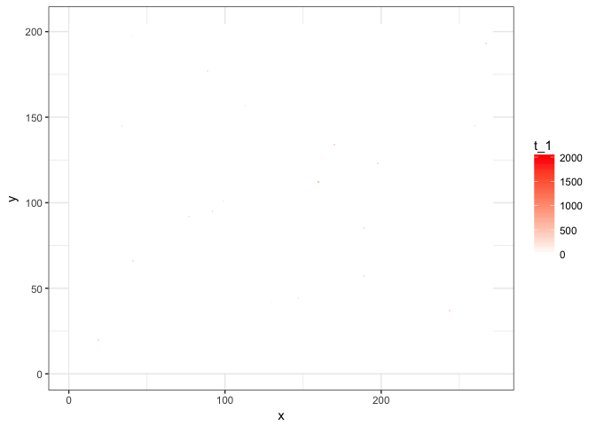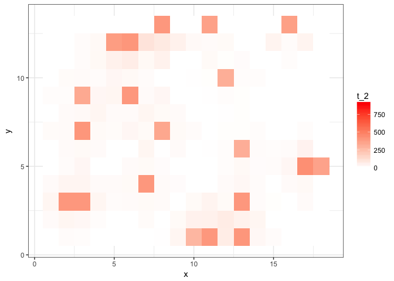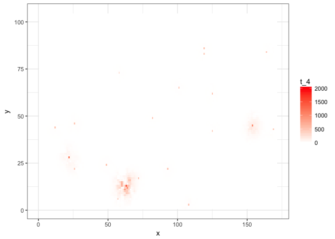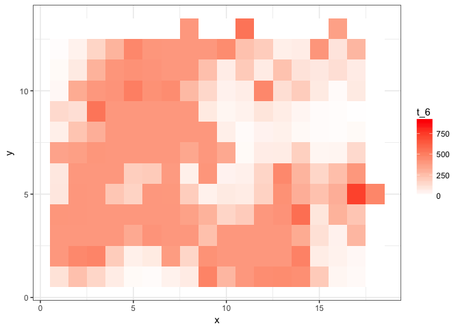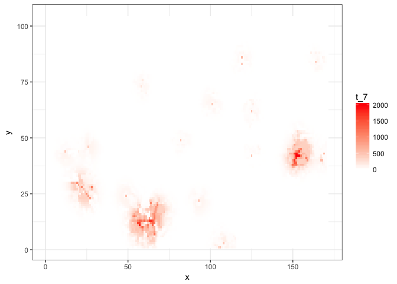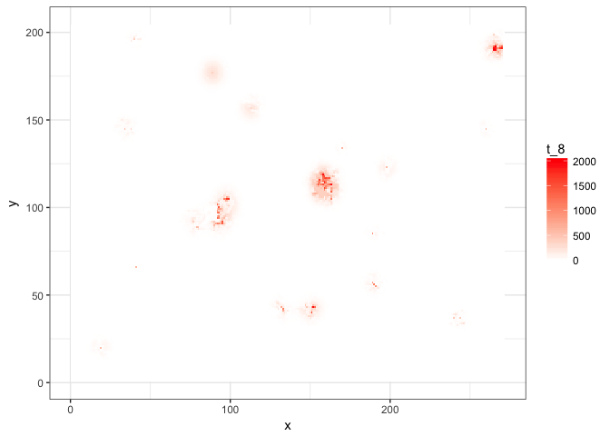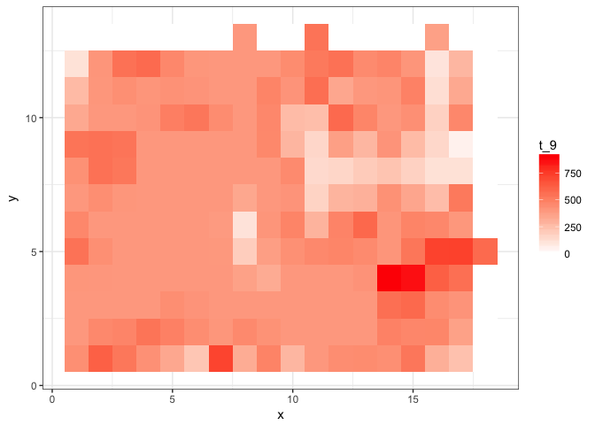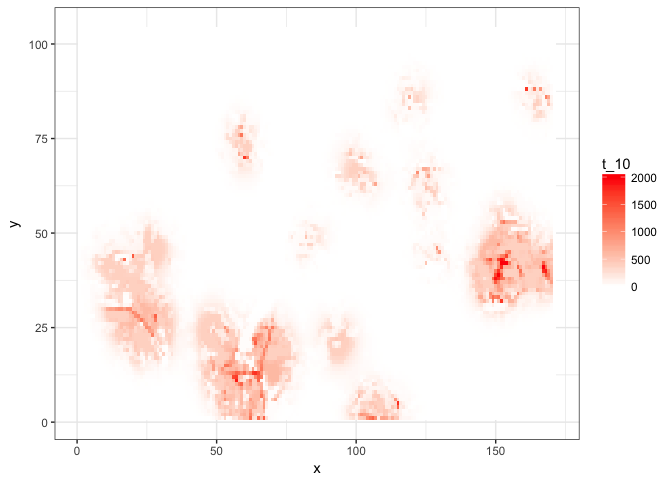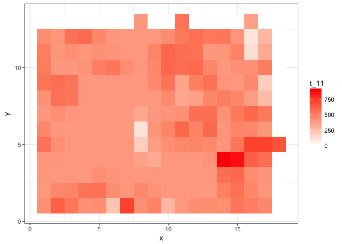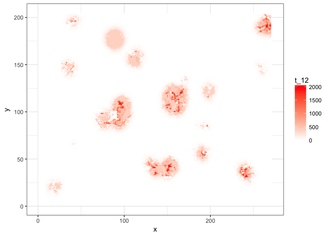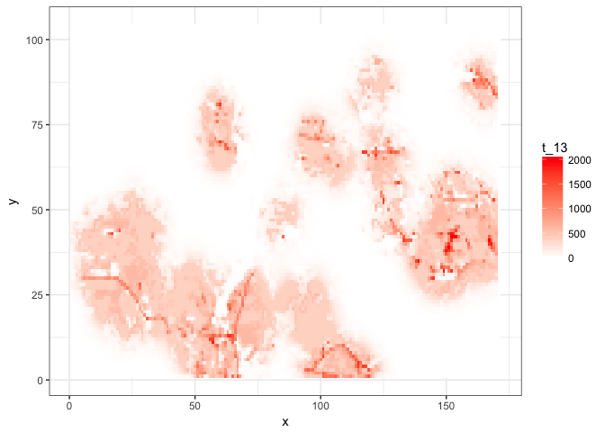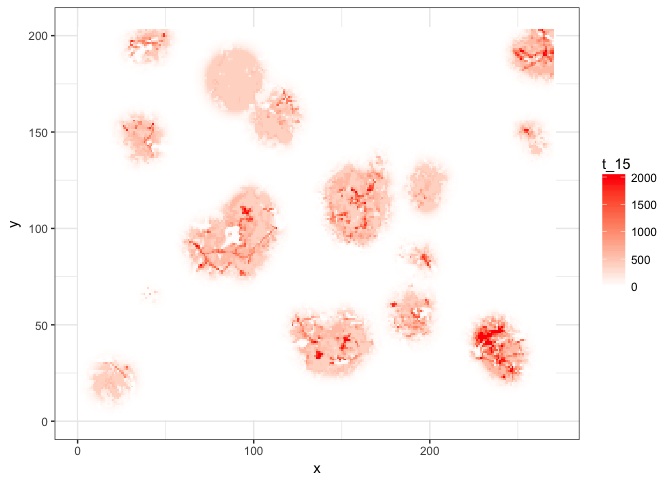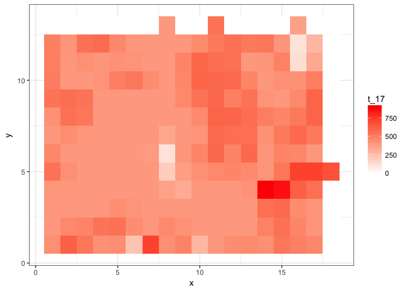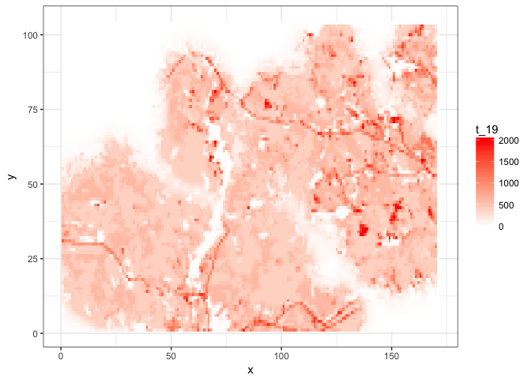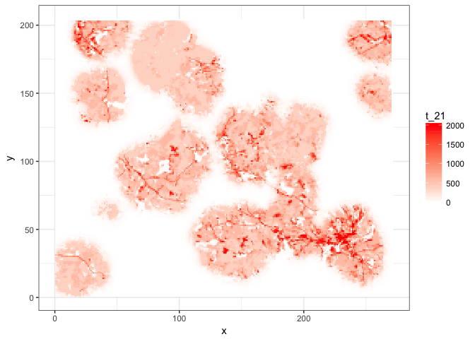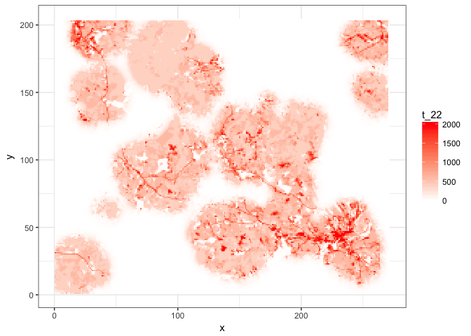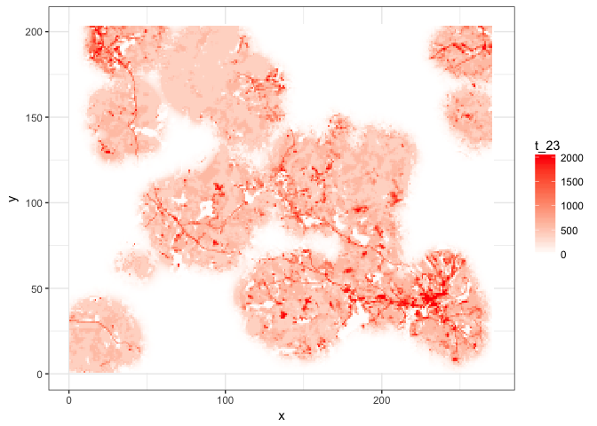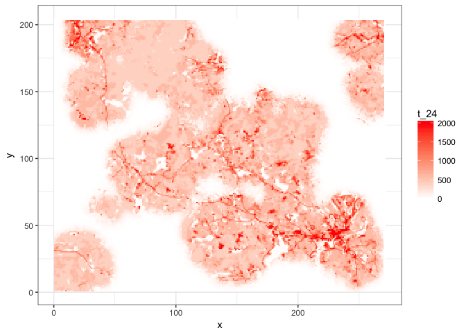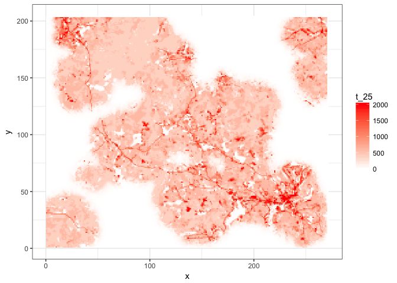

``` r
ggplot(N.out, aes(x=Dev)) + 
  geom_point(aes_string(y=paste0("t_", g.p$tmax)), alpha=0.1)
```

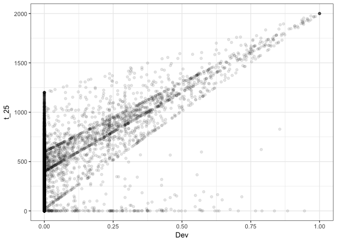

``` r
ggplot(N.out, aes(x=Oth)) + 
  geom_point(aes_string(y=paste0("t_", g.p$tmax)), alpha=0.1)
```

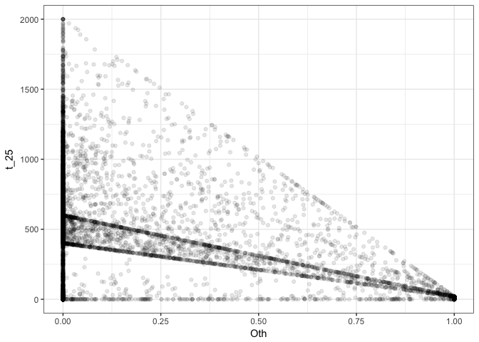

``` r
ggplot(N.out, aes(x=Hwd)) + 
  geom_point(aes_string(y=paste0("t_", g.p$tmax)), alpha=0.1)
```

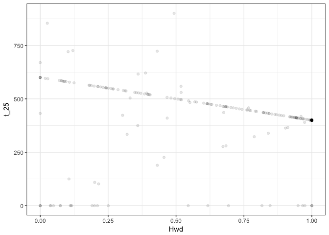

``` r
ggplot(N.out, aes(x=WP)) + 
  geom_point(aes_string(y=paste0("t_", g.p$tmax)), alpha=0.1)
```


``` r
ggplot(N.out, aes(x=Evg)) + 
  geom_point(aes_string(y=paste0("t_", g.p$tmax)), alpha=0.1)
```

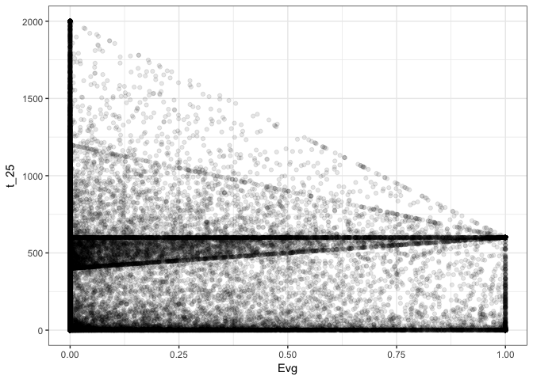

``` r
ggplot(N.out, aes(x=Mxd)) + 
  geom_point(aes_string(y=paste0("t_", g.p$tmax)), alpha=0.1)
```

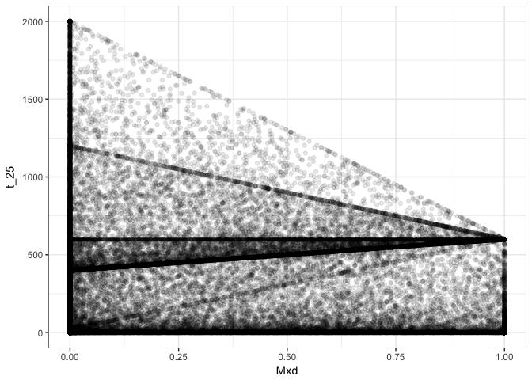
