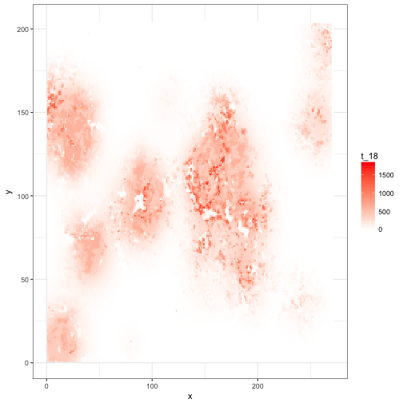
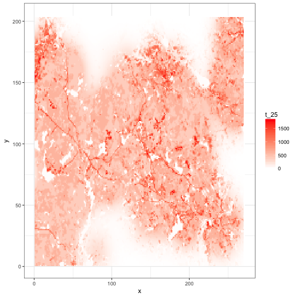

This is a wrapper for running the glossy buckthorn cellular automata model. It sets up the environment, allows the assignment of all necessary parameters, runs the simulation, and visualizes the results.

The land cover within each cell is compositional rather than the more common hard classification. As a result, all land cover-specific parameters are computed proportionally to the land cover in a cell (i.e., lc.prop %*% K, where lc.prop is a matrix with columns for land cover and a row for each cell, and K is a vector of carrying capacities with one per land cover type).


```r
##---
## set parameters
##---

  set.seed(25)
  n.sim <- 1
  blockSize <- 2  # number of acres per block (width & height)
  cb.i <- make_cb_i(blockSize)
```

```
## Parsed with column specification:
## cols(
##   left = col_double(),
##   top = col_double(),
##   CellID = col_integer(),
##   roadLen = col_double(),
##   roadCt = col_double()
## )
```

```r
  g.p <- list(
    # general
    tmax=25,  # num time steps per simulation
    stoch=FALSE,  # include stochasticity in demography/SDD?
    simple=TRUE,  # simple lambda growth vs. fruits/seeds
    n_cores=4,  # parallelize sdd.pr calculation
    
    # landscape
    lc.r=204,  # num rows in landscape
    lc.c=271,  # num columns in landscape
    n.lc=6,  # num land cover categories
    N.p.t0=30,  # num cells with buckthorn at t=1
    
    # demography
    K=c(2000, 20, 400, 1200, 600, 600),  # carrying capacity
    pr.f=c(0.9, 0.1, 0.29, 0.23, 0.2, 0.3),  # pr(fruit)
    fec=c(200, 100, 40, 20, 20, 10),  # mean(fruit per adult)
    densDepF=FALSE,
    bank=FALSE,  # include seedbank?
    pr.sb=c(0.3, 0.1, 0.2, 0.5, 0.4, 0.2),  # pr(ann.surv seed bank)
    pr.est=c(0.07, 0.01, 0.08, 0.02, 0.02, 0.03),  # pr(seedling est)
    lambda=c(2.5, 0.5, 1.6, 1.9, 1.8, 1.3),  # pop growth rate
    
    # dispersal
    sdd.max=15,  # max dispersal distance (unit: cells)
    sdd.rate=0.01,  # 1/mn for dispersal kernel
    trunc.diag=TRUE,  # restrict dispersal to sdd.max radius
    pr.eat=c(0.6, 0.5, 0.5, 0.25, 0.2, 0.8),  # pr(birds eat frt)
    bird.hab=c(0.2, 0.2, 0.5, 2, 0.8, 0.5),  # bird habitat prefs
    n.ldd=1   # num long distance dispersal events per year
  )
  

##--
## initialize landscape
##--
  
  # land cover
  ncell <- g.p$lc.r*g.p$lc.c
  Block.inc <- cb.i$BlockID[cb.i$BlockCol <= g.p$lc.c &
                            cb.i$BlockRow <= g.p$lc.r] %>% unique
  
  grnt <- read_csv(paste0("data/out_01_1a_grnt.csv")) %>% 
    mutate(CellID=1:nrow(.)) %>% add_blocks(cb.i=cb.i) %>% 
    summarise(Dev=sum(V1)/n(), Oth=sum(V2)/n(), Hwd=sum(V3)/n(), 
              WP=sum(V4)/n(), Evg=sum(V5)/n(), Mxd=sum(V6)/n()) %>%
    filter(BlockID %in% Block.inc) 
```

```
## Parsed with column specification:
## cols(
##   V1 = col_double(),
##   V2 = col_double(),
##   V3 = col_double(),
##   V4 = col_double(),
##   V5 = col_double(),
##   V6 = col_double()
## )
```

```r
  lc.df <- tibble(x=cb.i$BlockCol[match(grnt$BlockID, cb.i$BlockID)],
                  y=cb.i$BlockRow[match(grnt$BlockID, cb.i$BlockID)],
                  x_y=paste(x,y,sep="_"),
                  Dev=grnt$Dev, Oth=grnt$Oth, Hwd=grnt$Hwd,
                  WP=grnt$WP, Evg=grnt$Evg, Mxd=grnt$Mxd)
  
  # populations
  N.init <- rep(0, ncell)
  p.0 <- sample(1:ncell, g.p$N.p.t0)
  N.init[p.0] <- (as.matrix(lc.df[p.0,4:9]) %*% (g.p$K/2)) %>% round
  
  # dispersal probabilities
  system.time(sdd.pr <- sdd_set_probs(lc.df, g.p))
```

```
## generating neighborhoods...
## determining neighborhood cell IDs...
## calculating probabilities...
## finished cell 5000 
## finished cell 10000 
## finished cell 15000 
## finished cell 20000 
## finished cell 25000 
## finished cell 30000 
## finished cell 35000 
## finished cell 40000 
## finished cell 45000 
## finished cell 50000 
## finished cell 55000 
## finished: 55284 cells
```

```
##    user  system elapsed 
## 103.932  13.335 159.815
```


```r
for(s in 1:n.sim) {
  system.time(out <- run_sim(g.p, lc.df, sdd.pr, N.init, control.p=NULL))
}
```

```
## Year 1 - Growing...Dispersing locally...Dispersing regionally...Updating abundances.
## Year 2 - Growing...Dispersing locally...Dispersing regionally...Updating abundances.
## Year 3 - Growing...Dispersing locally...Dispersing regionally...Updating abundances.
## Year 4 - Growing...Dispersing locally...Dispersing regionally...Updating abundances.
## Year 5 - Growing...Dispersing locally...Dispersing regionally...Updating abundances.
## Year 6 - Growing...Dispersing locally...Dispersing regionally...Updating abundances.
## Year 7 - Growing...Dispersing locally...Dispersing regionally...Updating abundances.
## Year 8 - Growing...Dispersing locally...Dispersing regionally...Updating abundances.
## Year 9 - Growing...Dispersing locally...Dispersing regionally...Updating abundances.
## Year 10 - Growing...Dispersing locally...Dispersing regionally...Updating abundances.
## Year 11 - Growing...Dispersing locally...Dispersing regionally...Updating abundances.
## Year 12 - Growing...Dispersing locally...Dispersing regionally...Updating abundances.
## Year 13 - Growing...Dispersing locally...Dispersing regionally...Updating abundances.
## Year 14 - Growing...Dispersing locally...Dispersing regionally...Updating abundances.
## Year 15 - Growing...Dispersing locally...Dispersing regionally...Updating abundances.
## Year 16 - Growing...Dispersing locally...Dispersing regionally...Updating abundances.
## Year 17 - Growing...Dispersing locally...Dispersing regionally...Updating abundances.
## Year 18 - Growing...Dispersing locally...Dispersing regionally...Updating abundances.
## Year 19 - Growing...Dispersing locally...Dispersing regionally...Updating abundances.
## Year 20 - Growing...Dispersing locally...Dispersing regionally...Updating abundances.
## Year 21 - Growing...Dispersing locally...Dispersing regionally...Updating abundances.
## Year 22 - Growing...Dispersing locally...Dispersing regionally...Updating abundances.
## Year 23 - Growing...Dispersing locally...Dispersing regionally...Updating abundances.
## Year 24 - Growing...Dispersing locally...Dispersing regionally...Updating abundances.
## Year 25 - Growing...Dispersing locally...Dispersing regionally...Updating abundances.
```


```r
colnames(out) <- paste0("t_", 1:ncol(out))
N.out <- cbind(lc.df, out) %>% as.tibble

for(t in 1:g.p$tmax) {
  p.t <- ggplot(N.out, aes(x=x, y=y)) + 
    geom_tile(aes_string(fill=paste0("t_", t))) + 
    scale_fill_gradient(low="white", high="red", 
                        limits=range(out[,-ncol(out)]))
  print(p.t)
}
```



```r
ggplot(N.out, aes(x=Dev)) + 
  geom_point(aes_string(y=paste0("t_", g.p$tmax)), alpha=0.1)
```


```r
ggplot(N.out, aes(x=Oth)) + 
  geom_point(aes_string(y=paste0("t_", g.p$tmax)), alpha=0.1)
```


```r
ggplot(N.out, aes(x=Hwd)) + 
  geom_point(aes_string(y=paste0("t_", g.p$tmax)), alpha=0.1)
```


```r
ggplot(N.out, aes(x=WP)) + 
  geom_point(aes_string(y=paste0("t_", g.p$tmax)), alpha=0.1)
```


```r
ggplot(N.out, aes(x=Evg)) + 
  geom_point(aes_string(y=paste0("t_", g.p$tmax)), alpha=0.1)
```


```r
ggplot(N.out, aes(x=Mxd)) + 
  geom_point(aes_string(y=paste0("t_", g.p$tmax)), alpha=0.1)
```


